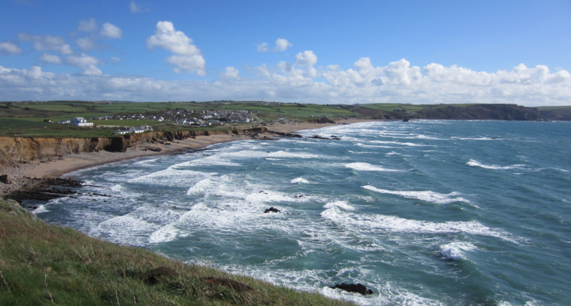
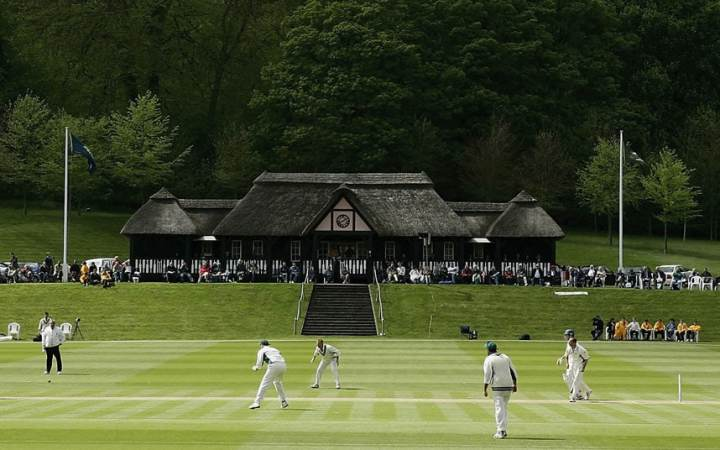

```{r setup, include=FALSE}
knitr::opts_chunk$set(echo = FALSE)
library(magick)

```

## About Bude
Bude is a town in western England widely known for its beaches. Bude is also known for having "the most beautiful cricket fields in England". In addition to the beautiful landscape, there is a wide variety of shops and pubs in Bude for all of your travel needs


## Northcott Mouth Beach
One of the most beautiful beaches in England and in Bude is shown below.


## Widemouth Beach
Another tourist favorite is Widemouth beach, toward the southern Edge of the town.


## Cricket Grounds
These are the famous Cricket Grounds in Bude.




## Pubs
My favorite pub, The Barrel at Bude, is just a short walk from the cricket grounds.


## Roadmap Plot
Below is a street map of Bude with my favorite beach spots and the best route from my favorite Cricket Club to my favorite Pub!
```{r echo=FALSE}
image_scale(image_read("roadmap.png"),geometry = "300%x200%")
```

## Watercolor Plot
Below is a map of Bude in watercolor with my favorite beach spots and the best route from my favorite Cricket Club to my favorite Pub!
```{r echo=FALSE}
image_scale(image_read("watercolor.png"),geometry = "300%x200%")
```
